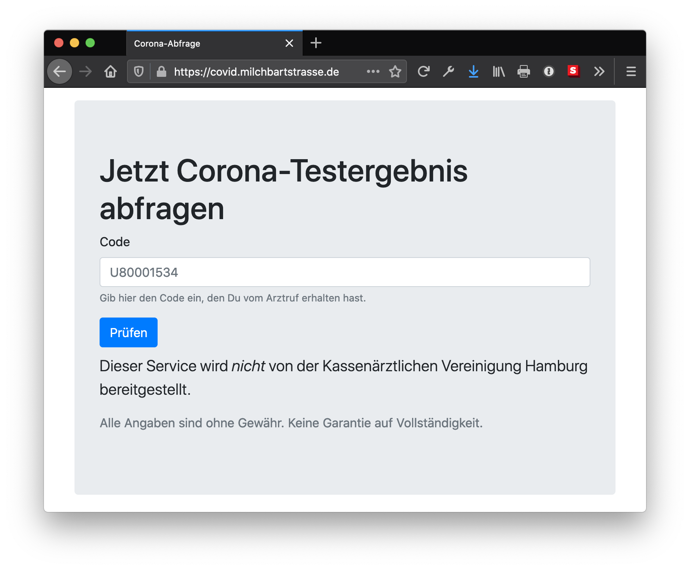

# SARS-CoV-2 test results for Hamburg

Web app that allows for an easy retrieval of [SARS-CoV-2 test results][6] from the _Arztruf Hamburg_.



## How it works

The app consists of three parts:

- A Node.js script (`download-pdf-files.js`) that scrapes the [website][6] and downloads all PDF files
- A Bash script (`convert-and-combine-all-pdf-files.sh`) that uses [tabula-java][7] to extract the tables from the PDF files.
  It then combines the data into one single CSV file
- The web app that consumes the combined CSV file and allows users to search it

## Setup

1. Download the [latest release][1] (the `.jar` file) of **tabula-java**
2. Rename it to `tabula.jar`. (Otherwise, the script will not be able to find it.)

## Manual run

In order to generate the large all-in-one CSV file, follow these steps.

1. Download the PDF files: `node download-pdf-files`
2. Convert the PDF files into one single CSV file: `./convert-and-combine-all-pdf-files.sh`

You can now browse _all_ test results from `all.csv`. Get well soon!

## Uberspace

Configuring the app for Uberspace is pretty easy:

1. On your Uberspace, create the directory where the app will be installed to (see the `post-receive` script)
2. [Register the supervisord service][2], using the `.ini` file that comes with this repository
3. Setup an empty repository on your Uberspace (`git init --bare`)
4. Add the `post-receive` hook to that repository
5. Add the repository as a remote to your clone of _this_ repository
6. Configure [the subdomain][3] and [the web backend][4]

### Crontab

In order to automatically update the data, [setup a Cronjob][5]:

```bash
# Download PDF files
0 */1 * * * /usr/bin/node /home/juitblip/apps/covid.milchbartstrasse.de/download-pdf-files >> /home/juitblip/apps/covid.milchbartstrasse.de/cronjob-download.log 2>&1

# Five minutes later, convert PDF to CSV
5 */1 * * * /home/juitblip/apps/covid.milchbartstrasse.de/convert-and-combine-all-pdf-files.sh >> /home/juitblip/apps/covid.milchbartstrasse.de/cronjob-convert.log 2>&1
```

This downloads the PDF files every hour and generates the CSV file five minutes later.

[1]: https://github.com/tabulapdf/tabula-java/releases/latest
[2]: https://manual.uberspace.de/daemons-supervisord.html
[3]: https://manual.uberspace.de/web-domains.html
[4]: https://manual.uberspace.de/web-backends.html
[5]: https://manual.uberspace.de/daemons-cron.html
[6]: https://www.kvhh.net/kvhh/pages/index/p/1424
[7]: https://github.com/tabulapdf/tabula-java